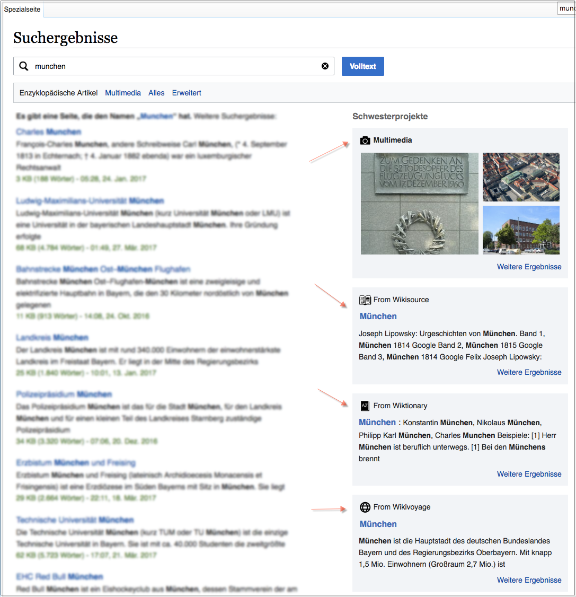

# Second Cross-wiki Search A/B Test

This repo is the analysis and report codebase for [Discovery](https://www.mediawiki.org/wiki/Special:MyLanguage/Wikimedia_Discovery)'s **second** [test of cross-wiki search](https://www.mediawiki.org/wiki/Cross-wiki_Search_Result_Improvements/Testing) (and follow-up to [this analysis](https://github.com/wikimedia-research/Discovery-Search-Test-CrosswikiSidebar)):

See [T160004](https://phabricator.wikimedia.org/T160004), [Discovery 2016-17 Q3 goals](https://www.mediawiki.org/wiki/Wikimedia_Engineering/2016-17_Q3_Goals#Discovery), and [Cross-wiki Search Result Improvements](https://www.mediawiki.org/wiki/Cross-wiki_Search_Result_Improvements) for more information.

The final report can be accessed by visiting [https://wikimedia-research.github.io/Discovery-Search-Test-CrosswikiSidebar-2/](https://wikimedia-research.github.io/Discovery-Search-Test-CrosswikiSidebar-2/) and the PDF version will be made available on Wikimedia Commons once the draft has been finalized.

This work is licensed under the Creative Commons Attribution 4.0 International License, so if you see anything you like and want to use, you are welcome to do that with attribution. To view a copy of this license, visit [http://creativecommons.org/licenses/by/4.0/](http://creativecommons.org/licenses/by/4.0/).
